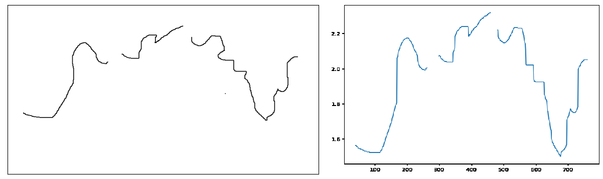
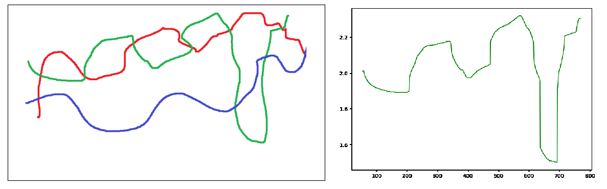

# sketch2graph
A lightweight program to transform a sketch of a graph into an array of numbers.

## Installation
```bash
git clone https://github.com/LeoViguier/sketch2graph.git
cd sketch2graph/
pip install -r requirements.txt
```

## Usage
### From the command line:
```bash
python sketch2graph.py -p path/to/graph.png -o path/to/output.npy
```
The full list of options is available by typing `python sketch2graph.py -h` in the command line.

### From a python script:
```python
from sketch2graph import s2g

array = s2g('path/to/graph.png')
```

## Example
```python
from sketch2graph import s2g
import matplotlib.pyplot as plt

array = s2g('graph.png', y_min=1.5, y_max=2.32)
plt.plot(array)
plt.show()
```


The program can also identify one graph if there are several on the same image, using the color of the graph:
```python
from sketch2graph import s2g
import matplotlib.pyplot as plt

color = (34, 177, 76) # RGB color of the green graph
array = s2g('graph2.png', graph_color=color)
plt.plot(array, c='g')
plt.show()
```


The full list of options is available in the docstring of the function `s2g`, or by typing `python sketch2graph.py -h` in the command line.

## Upcoming features

* I'll try to upload it to PyPI, so that it can be installed with `pip install sketch2graph`.
